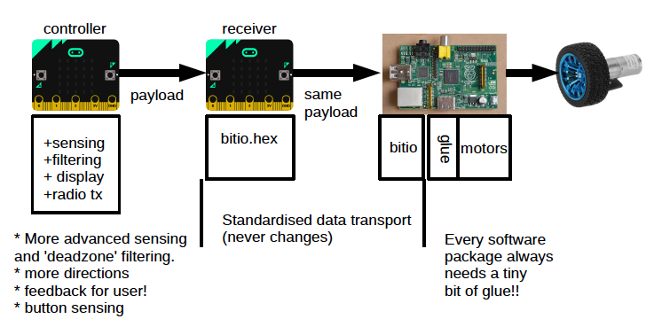
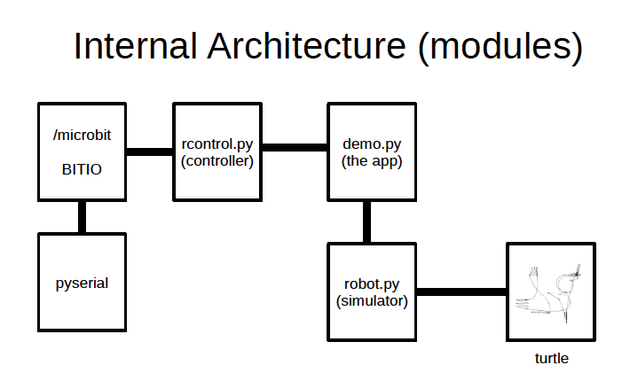

# A Wireless robot controller, built with a BBC micro:bit

## What is this?

This project allows you to build your own wireless remote control for
a robot, using two BBC micro:bit devices.

Here is a picture of what you get...



## What does it do?

The micro:bit on the left is battery powered, and when you tilt it, it will
send messages to the second micro:bit using the radio interface.

When a message is received by the second micro:bit, it sends the message
over a USB cable to your main computer. Typically this main computer will
be a Raspberry Pi running a Python program, and this program will control
the motors of your robot to make it move and turn.

## How do I use it?

1. Download the project files by pressing the green CODE button then pressing
on Download As Zip.

2. Unzip the zip file and copy it into a folder on your Raspberry Pi. 
You can also use it on a Mac, on Windows, or on Linux, as it includes a handy
visual robot simulator.

3. In the `for_microbit` folder you will find a file called `microbit_sensor.py`
and this is the wireless sender code. Drag and drop this file into the
online Python editor website: [Python Editor](https://python.microbit.org)
and then press its DOWNLOAD button to get a hex file that will run on the
micro:bit. 

4. Plug your controller micro:bit in via USB.
Either drag and drop this hex file onto the MICROBIT drive, or you could use
the new CONNECT feature and flash it directly from the web browser.

5. Remove your controller micro:bit and power it with batteries.

6. Plug your receive micro:bit into the USB drive. Inside the `for_microbit`
folder is a pre-written hex file called `bitio.hex` - drag and drop this
file onto the MICROBIT drive.

7. Run the demo code, and follow the on screen instructions that will walk
you through scanning and connecting to the micro:bit (it only does this
once and will remember the port when it finds it).

```
python3 demo.py
```

8. Now tilt your receiver micro:bit left, right, forward and backwards to
move the simulated robot around on the screen. If you hit the invisible
force-field, the robot will bounce backwards as if bumping into a wall!

## How does it work?

Here is a diagram of the internal architecture of the code:



This project uses another package called `bitio` which can be found here:
[Bitio Github page](https://github.com/whaleygeek/bitio)
Bitio is a reusable package that allows you to control a micro:bit over
USB directly from within Python on your main computer. You don't need to
worry though, as bitio is built-in to this robot-controller project.

Let's look through the architecture diagram. The pyserial package is built-in
as well, and it provides a standard way to send and receive characters over
the USB serial port to the connected micro:bit.

The `bitio` package is stored in the `microbit` folder, so that when you
use the line `import microbit` in your Python program, it automatically
connects to the micro:bit device and allows access to all of its features
directly from within the Python running on your main computer. One of the
things that this allows is the ability to turn the radio on and send and
receive radio messages, which is how it will communicate with the wireless
controller you loaded code onto earlier.

`rcontrol.py` is the remote control host code that runs on your main computer,
and it is responsible for receiving radio messages, decoding the contents
of the message, and making the values available to the rest of the program.
So, it hides (or abstracts a way) all the nitty gritty details about how
to communicate wirelessly with the micro:bit and how to get values out from
the incoming radio message. What you get back is a gear (forward, backward,
stop), a speed (0..99) and a direction (-99..0..99).

`demo.py` is the demonstration application, and it basically asks rcontrol.py
for the sensed values and translates those into movement commands for the
virtual robot.

`robot.py` is a simple robot simulator using the Python turtle package, and
provides an on-screen way to test out the code before you do anything else
with it.

## How can I connect to my motor driver?

Yes, but of course you want to connect this up to the motor driver on your
real robot, don't you? How do you do that?

This package will work with any motor controller, but it is impossible for us
to write code for all possible motor drivers. Instead, we have provided a
small customisable region of code in the `demo.py` file that you change and
this is where you disconnect the demo code from the visual robot simulator,
and connect it to your real motor controller code.

Here is the main loop of the demo program...

```python
while True:
    changed, gear, speed, direction = remote.sense()
    if changed:
        if   gear == remote.FORWARD:    forward(speed)
        elif gear == remote.BACKWARD:   backward(speed)
        elif gear == remote.STOP:       stop()
        steer(direction)
    robby.move()
    time.sleep(0.1)
```

Looking at the above code, you can see that it loops round forever,
reading the controller and passing those commands onto Robby the Robot
(Forbidden Planet, anyone? Pass the popcorn!)

Robby the Robot is a simple Python turtle visual robot. He needs waking up
every so often as he keeps going to sleep, so the `robby.move()` line ensures
that he keeps moving like a real robot would if you turned on its motors.

To add in your own robot controller, first comment out the robby.move line 
like this:

```python
    #robby.move()
```

The next bit of code to change is further up the file, here it is:

```python
def forward(speed=100):
    # change this to move your robot forward
    robby.forward(speed)

def backward(speed=100):
    # change this to move your robot backward
    robby.backward(speed)

def stop():
    # change this to stop your robot
    robby.stop()

def steer(direction=0):
    # change this to steer your robot
    robby.steer(direction)
```

You can see that the `forward()`, `backward()`, `stop()` and `steer()` commands
are wired directly to Robby here. Comment out the lines that begin with `robby`
and replace them with the code required to drive your motor controller.

If you don't have speed control, just make `forward()` turn both motors
clockwise, and make `backward()` turn both motors anti-clockwise. Also,
make `stop()` turn both motors off. Steering is a little harder.

Depending on how many wheels your robot has, you may have to write different
code here. Let's assume you have a two-wheel robot with a front ball bearing
support, and let's assume you have no speed control. So, if the direction is
negative (direction<=-1) you want to turn left (so turn the left motor 
anti-clockwise and the right motor clockwise). If the direction is positive 
(direction>=1) you want to turn right (so turn the left motor clockwise and the 
right motor anti-clockwise).

To steer straight ahead (direction==0), both motors need to turn the same way.

Of course, whether the motors turn clockwise or anti-clockwise will depend
on the `forward()` or `backward()` request. You could use a global variable
to store the gear setting, and then do all the motor control code in
the `steer()` function if you want.

If you have speed control of your motors (e.g. PWM control), you can use the 
`speed` parameter to set the PWM percentage, and you can use the `direction`
variable to set the blend of left and right motors to adjust how far you
steer. Or, if you have a servo motor for steering, you can drive the position
of that based on the `direction` value.

`speed` is between 0 and 100, where 0 is off and 100 is full speed.

`direction` is between -100 to +100, where -100 is full left, 0 is straight
ahead, and +100 is full right.

## What else can I change?

Well, this is open source code, so change it all!

The file `for_microbit/microbit_sensor.py` has some constants at the top
that you can change to fine-tune its sensitivity a bit, you could start
experimenting with those. 

A larger `DEADZONE` will give you a larger region of tilt whereby the robot will 
stop.

The `UPDATEMS` constant controls the responsiveness of the system, 200ms
will send 5 messages per second which should be fine, but using a smaller
number here will increase the responsiveness (but might flood your receiver
with so many messages that it gets a bit overloaded!).

The `UNIQUE` constant sets the two characters at the start of the message.
So, if you know there are other micro:bits in range using the same program,
change this to something unique to you. There is another copy of this
constant in the `rcontrol.py` file that needs to be the same, and the
receiver will ignore any message that does not begin with these two characters.

## How do I get help?

The best way to get help is to first ask a friend, or ask an adult or teacher
if they can help. You can also log a github issue (press on the ISSUE) link
at the top of this page, and ask a question here.

David Whale

@whaleygeek

22 Jan 2021

